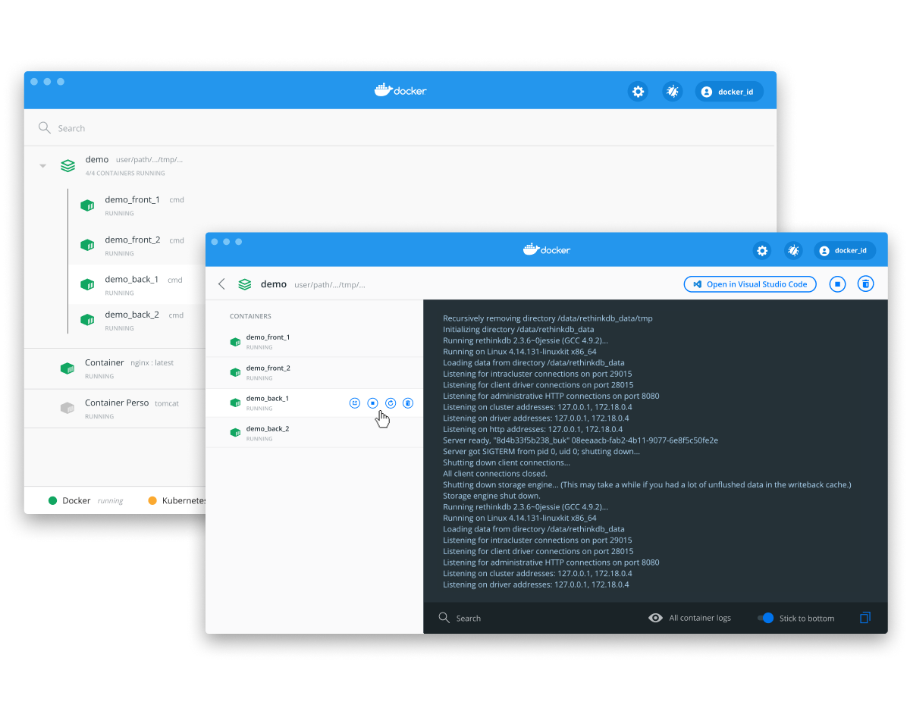
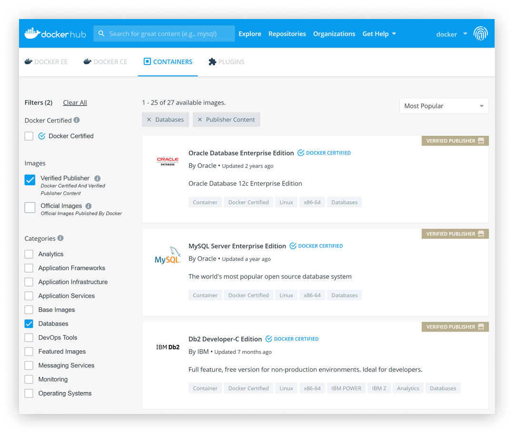

# Docker

-   [What is Docker?](#what-is-docker)
    -   [How does Docker work?](#how-does-docker-work)
    -   [What is a Docker container?](#what-is-a-docker-container)
    -   [Containers vs Virtual Machines](#containers-vs-virtual-machines)
    -   [Advantages of Docker containers](#advantages-of-docker-containers)
-   [Why Docker?](#why-docker)
    -   [Developing with Docker](#developing-with-docker)
    -   [All begun with containers](#all-begun-with-containers)
-   [Docker Solutions](#docker-solutions)
    -   [Docker Desktop](#docker-desktop)
    -   [Docker Hub](#docker-hub)
-   [Get Docker Desktop](#get-docker-desktop)
-   [Docker Get Started](#docker-get-started)
-   [Docker Tutorial](#docker-tutorial)
-   [Docker Reference Documentation](#docker-reference-documentation)
    -   [Dockerfile](#dockerfile)
    -   [Compose](#compose)

## What is Docker?

Docker is a set of Platform as a Service (PaaS) products that use OS-level virtualization to deliver software in packages called **containers**.

With Docker, you can treat containers like extremely lightweight, modular virtual machines. So that, you get flexibility with those containers&mdash;you can create, deploy, copy, and move them from environment to environment, that is really helpful to optimize apps for the cloud.

**Sources**
-   [**Wikipedia** | Docker (software)](https://en.wikipedia.org/wiki/Docker_(software)) (_external link_)
-   [**Red Hat** | What is Docker? | Overview](https://www.redhat.com/en/topics/containers/what-is-docker#overview) (_external link_)

## How does Docker work?

Primarly, Docker technology uses the Linux kernel and features of the kernel, like Cgroups and namespaces, to segregate processes so they can run independently.
This independence is the intention of containers&mdash;the ability to run multiple processes and apps separately from one another to make better use of your infrastructure while retaining the security you would have with separate systems.

Container tools like Docker provide an image-based deployment model. This makes it easy to share an application, or set of services, with all of their dependencies across multiple environments. Docker also automates deploying the application (or combined sets of processes that make up an app) inside this container environment.

These tools built on top of Linux containers—what makes Docker user-friendly and unique—gives users unprecedented access to apps, the ability to rapidly deploy, and control over versions and version distribution.

**Sources**
-   [**Red Hat** | What is Docker? | How does it work?](https://www.redhat.com/en/topics/containers/what-is-docker#how-does-it-work) (_external link_)

## What is a Docker container?

A **container** is a standard unit of software that packages up code and all its dependencies so the application runs quickly and reliably from one computing environment to another.

Containers are isolated from one another and bundle their own software, libraries and configuration files.
They can communicate with each other through well-defined channels.

A Docker container image is a lightweight, standalone, executable package of software that includes everything needed to run an application: code, runtime, system tools, system libraries and settings.
Because all of the containers share the services of a single operating system kernel, they use fewer resources than virtual machines.

Docker containers that run on Docker Engine:
-   **Standard**: Docker created the industry standard for containers, so they could be portable anywhere
-   **Lightweight**: Containers share the machine’s OS system kernel and therefore do not require an OS per application, driving higher server efficiencies and reducing server and licensing costs
-   **Secure** : Applications are safer in containers and Docker provides the strongest default isolation capabilities in the industry

**Sources**
-   [**Docker** | What is a Container?](https://www.docker.com/resources/what-container) (_external link_)
-   [**Wikipedia** | Docker (software)](https://en.wikipedia.org/wiki/Docker_(software)) (_external link_)

## Containers vs Virtual Machines

Containers and virtual machines have similar resource isolation and allocation benefits, but function differently because containers virtualize the operating system instead of hardware. Containers are more portable and efficient.

Containers and VMs used together provide a great deal of flexibility in deploying and managing app

**Sources**
-   [**Docker** | What is a Container?](https://www.docker.com/resources/what-container) (_external link_)

### Containers

Containers are an abstraction at the app layer that packages code and dependencies together.
Multiple containers can run on the same machine and share the OS kernel with other containers, each running as isolated processes in user space.
Containers take up less space than VMs (container images are typically tens of MBs in size), can handle more applications and require fewer VMs and Operating systems.

### Virtual Machines

Virtual machines (VMs) are an abstraction of physical hardware turning one server into many servers. The hypervisor allows multiple VMs to run on a single machine. Each VM includes a full copy of an operating system, the application, necessary binaries and libraries - taking up tens of GBs. VMs can also be slow to boot.

## Advantages of Docker containers

**Sources**
-   [**Red Hat** | What is Docker? | Advantages of Docker container](https://www.redhat.com/en/topics/containers/what-is-docker#advantages-of-docker) (_external link_)

### Modularity

The Docker approach to containerization focuses on the ability to take down a part of an application to update or repair, without having to take down the whole app. In addition to this microservices-based approach, you can share processes among multiple apps in much the same way service-oriented architecture (SOA) does.

### Layers and image version control

Each Docker image file is made up of a series of layers that are combined into a single image. A layer is created when the image changes. Every time a user specifies a command, such as run or copy, a new layer gets created.

Docker reuses these layers to build new containers, which accelerates the building process. Intermediate changes are shared among images, further improving speed, size, and efficiency. Also inherent to layering is version control: Every time there’s a new change, you essentially have a built-in changelog, providing you with full control over your container images.

### Rollback

Perhaps the best part about layering is the ability to roll back. Every image has layers. Don’t like the current iteration of an image? Roll it back to the previous version. This supports an agile development approach and helps make continuous integration and deployment (CI/CD) a reality from a tools perspective.

### Rapid deployment
Getting new hardware up, running, provisioned, and available used to take days, and the level of effort and overhead was burdensome. Docker-based containers can reduce deployment to seconds. By creating a container for each process, you can quickly share those processes with new apps. And, since an operating system doesn’t need to boot to add or move a container, deployment times are substantially shorter. Paired with shorter deployment times, you can easily and cost-effectively create and destroy data created by your containers without concern.

So, Docker technology is a more granular, controllable, microservices-based approach that places greater value on efficiency.

## Why Docker?

**Sources**
-   [**Docker** | Why Docker?](https://www.docker.com/why-docker) (_external link_)

### Developing with Docker

Developing apps today requires so much more than writing code.
Multiple languages, frameworks, architectures, and discontinuous interfaces between tools for each lifecycle stage creates enormous complexity.
Docker simplifies and accelerates your workflow, while giving developers the freedom to innovate with their choice of tools, application stacks, and deployment environments for each project.

### All begun with containers

Containers are a standardized unit of software that allows developers to isolate their app from its environment, solving the “it works on my machine” headache.
For millions of developers, Docker is the de facto standard to build and share containerized apps - from desktop, to the cloud.
We are building on our unique connected experience from code to cloud for developers and developer teams.

### Simplify App Complexity with Docker

-   **Keep it Simple**: Docker’s friendly, CLI-based workflow makes building, sharing, and running containerized applications accessible to developers of all skill levels.

-   **Move Fast**: Install from a single package to get up and running in minutes. Code and test locally while ensuring consistency between development and production.

-   **Collaborate**: Use Certified and community-provided images in your project. Push to a cloud-based application registry and collaborate with team members.

## Docker Solutions

**Sources**
-   [**Docker** | Get Started](https://www.docker.com/get-started) (_external link_)

### Docker Desktop

Docker Desktop is an application that enables you to build and share containerized applications and microservices. Docker Desktop enables development teams to extend their environment to rapidly auto-build, continuously integrate, and collaborate using a secure repository.

Some of the key features of Docker Desktop include:
-   Ability to containerize and share any application on any cloud platform, in multiple languages and frameworks
-   Easy installation and setup of a complete Docker development environment
-   Includes the latest version of Kubernetes
-   Automatic updates to keep you up to date and secure
-   On Windows, the ability to toggle between Linux and Windows Server environments to build applications
-   Fast and reliable performance with native Windows Hyper-V virtualization
-   Ability to work natively on Linux through WSL 2 on Windows machines
-   Volume mounting for code and data, including file change notifications and easy access to running containers on the localhost network
-   In-container development and debugging with supported IDEs

Docker Desktop is an easy-to-install application for your Mac or Windows environment that enables you to build and share containerized applications and microservices.

-   [**Docker Hub** | Docker Desktop for Mac](https://hub.docker.com/editions/community/docker-ce-desktop-mac) (_external link_)
-   [**Docker Hub** | Docker Desktop for Windows](https://hub.docker.com/editions/community/docker-ce-desktop-windows) (_external link_)

Docker Desktop includes:
-   Docker Engine
-   Docker CLI client
-   Docker Compose
-   Docker Content Trust
-   Kubernetes
-   Credential Helper

### Docker Hub

Cloud-based application registry and development team collaboration services.

For developers and those experimenting with Docker, Docker Hub is your starting point into Docker containers. Create an account and start exploring the millions of images that are available from the community and verified publishers.

-   [**Docker** | Docker Hub](https://www.docker.com/products/docker-hub) (_external link_)

-   [**Docker Hub** | Containerized App Images](https://hub.docker.com/search?q=&type=image) (_external link_)

## Get Docker

You can download and install Docker on multiple platforms.

**Source**
-   [**Docker Docs** | Get Docker](https://docs.docker.com/get-docker/) (_external link_)

### Docker Desktop for Mac

A native application using the macOS sandbox security model which delivers all Docker tools to your Mac.

-   [**Docker Docs** | Docker Desktop for Mac](https://docs.docker.com/desktop/mac/install/) (_external link_)

### Docker Desktop for Windows

A native Windows application which delivers all Docker tools to your Windows computer.

-   [**Docker Docs** | Docker Desktop for Windows](https://docs.docker.com/desktop/windows/install/) (_external link_)

### Docker for Linux

Install Docker on a computer which already has a Linux distribution installed.

-   [**Docker Docs** | Docker for Linux](https://docs.docker.com/engine/install/) (_external link_)

## Docker Get Started

**Source**
-   [**Docker Docs** | Get Started](https://docs.docker.com/get-started/) (_external link_)

Here you will find step-by-step instructions on how to get started with Docker. 
You’ll learn how to:
-   Build and run an image as a container
-   Share images using Docker Hub
-   Deploy Docker applications using multiple containers with a database
-   Running applications using Docker Compose

## Docker Tutorial

**Source**
-   [**Docker** | Tutorial](https://www.docker.com/101-tutorial) (_external link_)

With this self-paced, hands-on tutorial, you can learn how to build images, run containers, use volumes to persist data and mount in source code, and define your application using Docker Compose.
You'll even learn about a few advanced topics, such as networking and image building best practices.

You can take the tutorial on your desktop or in the cloud.

### Docker Desktop Tutorial

Docker Desktop is a native application that delivers all of the Docker tools to your Mac or Windows Computer. 

1.  Open Docker Desktop. (Download here if you don't have it).
2.  Type the following command in your terminal: `docker run -dp 80:80 docker/getting-started`
3.  Open your browser to http://localhost
4.  Have fun!

### Play with Docker

Play with Docker is an interactive playground that allows you to run Docker commands on a linux terminal, no downloads required.

1.  Log into https://labs.play-with-docker.com/ to access your PWD terminal
2.  Type the following command in your PWD terminal: `docker run -dp 80:80 docker/getting-started:pwd`
3.  Wait for it to start the container and click the port 80 badge
4.  Have fun!

## Docker Reference Documentation

**Source**
-   [**Docker Docs** | Reference documentation](https://docs.docker.com/reference/) (_external link_)

### Dockerfile

Defines the contents and startup behavior of a single container.

Docker can build images automatically by reading the instructions from a Dockerfile. A Dockerfile is a text document that contains all the commands a user could call on the command line to assemble an image. Using docker build users can create an automated build that executes several command-line instructions in succession.

**Source**
-   [**Docker Docs** | Dockerfile reference](https://docs.docker.com/engine/reference/builder/) (_external link_)

### Compose

Defines multi-container application.

Compose is a tool for defining and running multi-container Docker applications. With Compose, you use a YAML file to configure your application’s services. Then, with a single command, you create and start all the services from your configuration. To learn more about all the features of Compose, see the list of features.

Compose works in all environments: production, staging, development, testing, as well as CI workflows. You can learn more about each case in Common Use Cases.

Compose documentation:
-   [**Docker Docs** | Compose User guide](https://docs.docker.com/compose/) (_external link_)
-   [**Docker Docs** | Installing Compose](https://docs.docker.com/compose/install/) (_external link_)
-   [**Docker Docs** | Command line reference](https://docs.docker.com/compose/reference/) (_external link_)
-   [**Docker Docs** | Docker Compose file](https://docs.docker.com/compose/compose-file/) (_external link_)

**Source**
-   [**Docker Docs** Docker Compose](https://docs.docker.com/compose/) (_external link_)