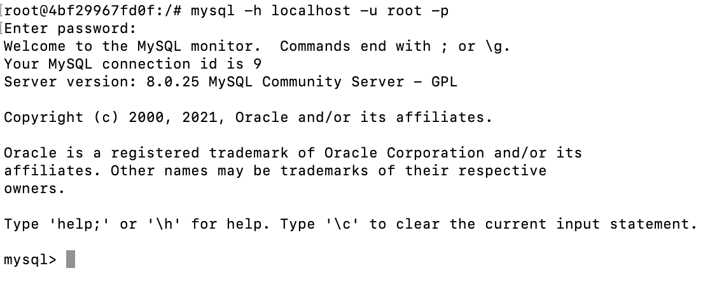
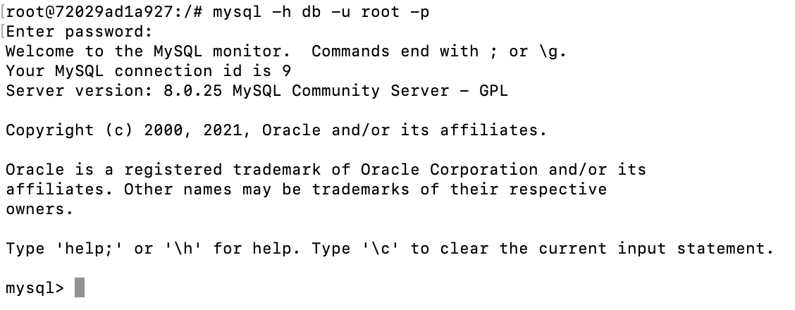
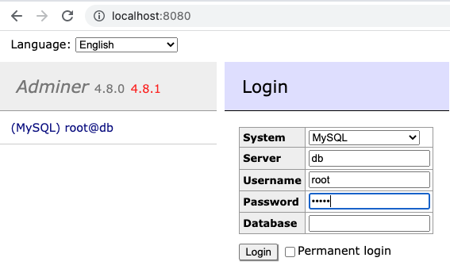
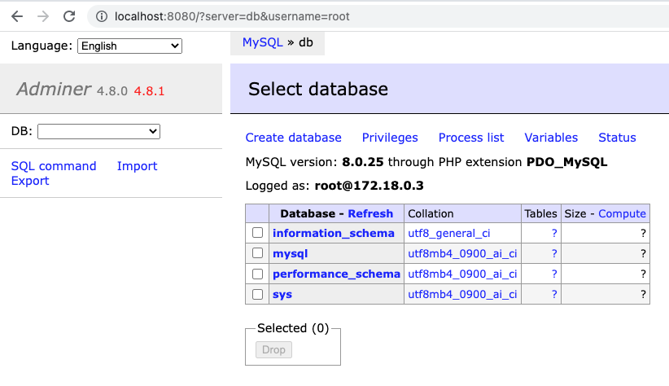
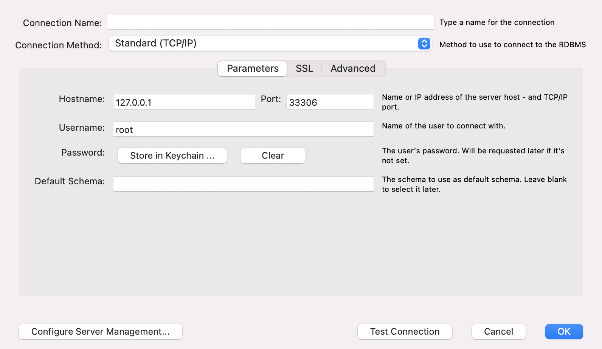
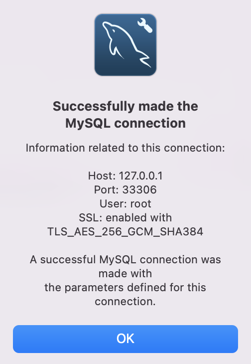

# MySQL Docker Container

**Source**: [https://hub.docker.com/_/mysql
](https://hub.docker.com/_/mysql
)

-   [What is MySQL?](#what-is-mysql)
-   [Prerequisites](#prerequisites)
-   [Start a `mysql` database container](#start-a-mysql-database-container)
-   [Access to container shell](#access-to-container-shell)
-   [Access to container logs](#access-to-container-logs)
-   [Connect to container `mysql` database by command line client](#connect-to-container-mysql-database-by-command-line-client)
-   [Configure a container with `mysql` database service (**Docker Compose**)](#configure-a-container-with-mysql-database-service-docker-compose)
-   [Run Docker Compose container](#run-docker-compose-container)
-   [Stop Docker Compose container](#stop-docker-compose-container)
-   [Connect to container `mysql` database from container shell](#connect-to-container-mysql-database-from-container-shell)
-   [Configure a container with `mysql` database and adminer services (**Docker Compose**)](#configure-a-container-with-mysql-database-and-adminer-services-docker-compose)
-   [Configure a container with `mysql` database service with exposed port (**Docker Compose**)](#configure-a-container-with-mysql-database-service-with-exposed-port-docker-compose)
-   [Connect to container `mysql` database from outside](#connect-to-container-mysql-database-from-outside)

## What is MySQL?

MySQL is the most popular open-source relational database management system (RDBMS). MySQL has become the leading database choice for all kind of applications, covering the entire range from personal projects and websites to high profile web properties.


## Prerequisites

Make sure you have a current version of Docker installed on your machine. If you do not have Docker installed, choose your preferred operating system below to download Docker:

-   Mac
    -   [Mac with Intel chip](https://desktop.docker.com/mac/main/amd64/Docker.dmg) (_external link_)
    -   [Mac with Apple chip](https://desktop.docker.com/mac/main/arm64/Docker.dmg) (_external link_)
-   [Windows](https://desktop.docker.com/win/main/amd64/Docker%20Desktop%20Installer.exe) (_external link_)
-   [Linux](https://docs.docker.com/engine/install/) (_external link_)

For Docker Desktop installation instructions, see [Install Docker Desktop on Mac](https://docs.docker.com/desktop/mac/install/) (_external link_) and [Install Docker Desktop on Windows](https://docs.docker.com/desktop/windows/install/) (_external link_).


## Start a `mysql` database container

To start a MySQL container is as simple as execute this command:

`docker run --name <container_name> -e MYSQL_ROOT_PASSWORD=<root_password> -d mysql:<tag>
`

-   `<container_name>` is the name you want to assign to your container (i.e. `mysql-db`).
-   `<root_password>` is the MySQL root user password to be set (i.e. `mysql`)
-   `<tag>` is the label of the specific MySQL version you want to use (i.e. `latest`).

```
docker run --name mysql-db -e MYSQL_ROOT_PASSWORD=mysql -d mysql:latest
```

## Access to container shell

With the `docker exec` command you can run commands inside the Docker container.

To access the bash shell inside the `mysql` container, just run:

`docker exec -it <container_name> bash`

```
docker exec -it mysql-db bash
```


## Access to container logs

With the `docker logs` command you can access the Docker container logs.

To access the logs inside the `mysql` container, just run:

`docker logs <container_name>`

```
docker logs mysql-db
```

## Connect to container `mysql` database by command line client

First, access the container shell:
```
docker exec -it mysql-db bash
```

Then, you can connect to your mysql database with `mysql` command line client:

`mysql -h <db_host> -u <username> -p`

-   `<db_host>` The database host: Use `localhost` or database service name.
-   `<username>` The database user: Use the `root` user

```
mysql -h localhost -u root -p
```

Enter the configured password (`MYSQL_ROOT_PASSWORD` value): `mysql`

And you will be connected to the database.



## Configure a container with `mysql` database service (Docker Compose)

Create a `mysql-stack.yml` file:
```
# Use root/mysql as user/password credentials

version: '3.8'

services:

    db:
        image: mysql
        command: --default-authentication-plugin=mysql_native_password
        restart: always
        environment:
            MYSQL_ROOT_PASSWORD: mysql
```
Docker Compose file: [mysql-stack.yml](mysql-stack.yml)

## Run Docker Compose container

To run up the container, execute this command:

`docker-compose -f <compose_file> up`

If you want to run the container in background, you can add the `-d` option to the command:

`docker-compose -f <compose_file> up -d`

```
docker-compose -f mysql-stack.yml up
```

## Stop Docker Compose container

Use this command to stop the container:

`docker-compose -f <compose_file> down`

```
docker-compose -f mysql-stack.yml down
```

## Connect to container `mysql` database from container shell

To connect to the database you have to access first to the container shell:
```
docker exec -it mysql-db bash
```

Then you just have to run the `mysql` command line client using the database service name: `db`
```
mysql -h db -u root -p
```

Enter the configured password (`MYSQL_ROOT_PASSWORD` value): `mysql`

And you will be connected to the database.



## Configure a container with `mysql` database and `adminer` services (Docker Compose)

Create a `mysql-adminer-stack.yml` file:
```
# Use root/mysql as user/password credentials

version: '3.8'

services:

    db:
        image: mysql
        command: --default-authentication-plugin=mysql_native_password
        restart: always
        environment:
            MYSQL_ROOT_PASSWORD: mysql

    adminer:
        image: adminer
        restart: always
        ports:
            - 8080:8080
```

Docker Compose file: [mysql-adminer-stack.yml](mysql-adminer-stack.yml)

To run up the container, run this command:
```
docker-compose -f mysql-adminer-stack.yml up -d
```

After running up the container, you can access the database through the adminer url: http://localhost:8080



Login with configured credentials
-   User: `root`
-   Password: `mysql`

And you will get into a page like this:




## Configure a container with `mysql` database service with exposed port (Docker Compose)

Create a `mysql-ports-stack.yml` file and expose the mysql database through the `33306` port:
```
# Use root/mysql as user/password credentials

version: '3.8'

services:

    db:
        image: mysql
        command:
            --default-authentication-plugin=mysql_native_password
        restart: always
        environment:
            MYSQL_ROOT_PASSWORD: mysql
        ports:
            - "33306:3306"
```

Docker Compose file: [mysql-ports-stack.yml](mysql-ports-stack.yml)

To run up the container, run this command:
```
docker-compose -f mysql-ports-stack.yml up -d
```

## Connect to container `mysql` database from outside

Now you have exposed the database port, you can access the database throught an external connection tool like MySQL Workbench:



-   Hostname: `127.0.0.1`
-   Port: `33306`
-   Username: `root`
-   Password: `mysql`

And you will connect:



